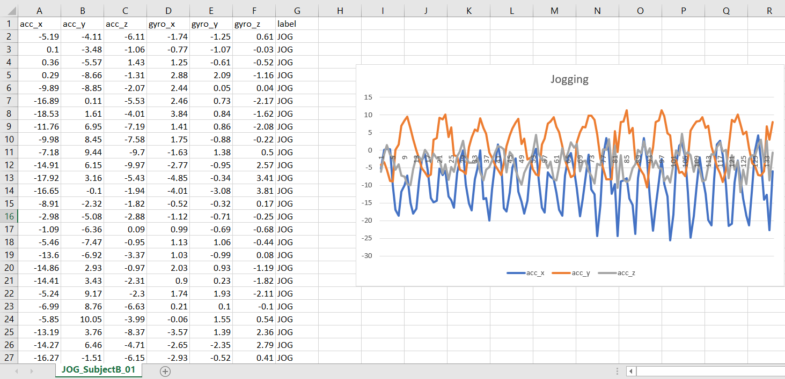
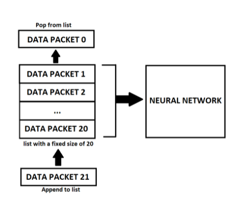
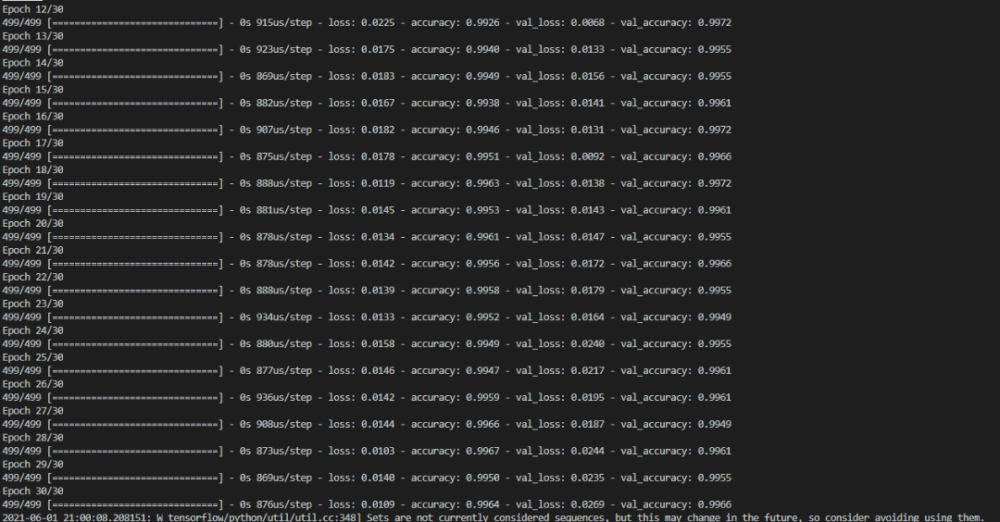
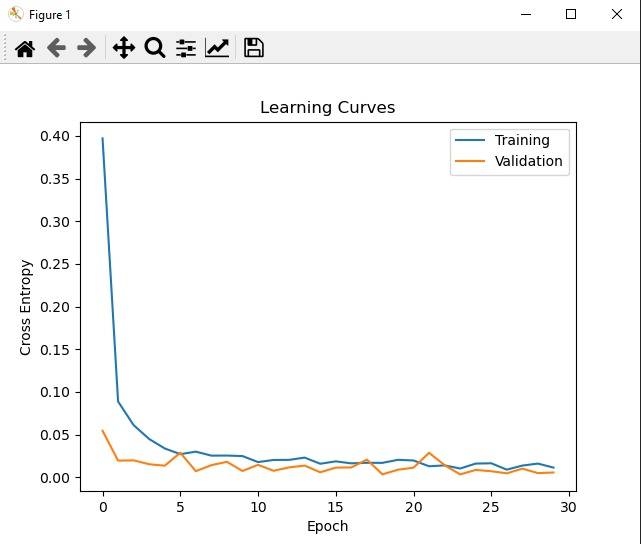
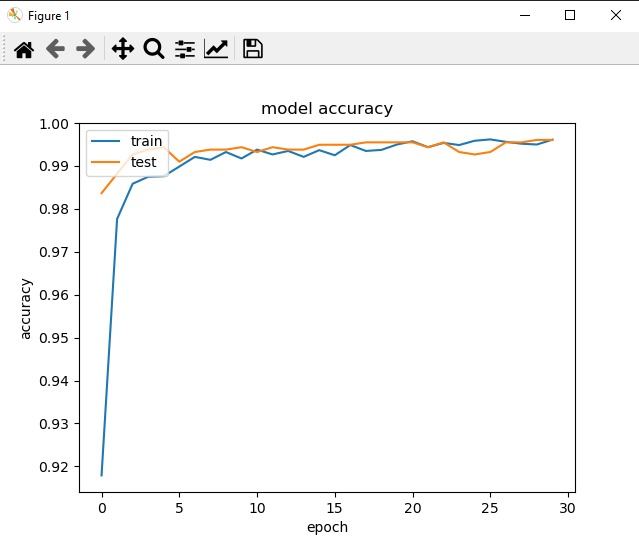
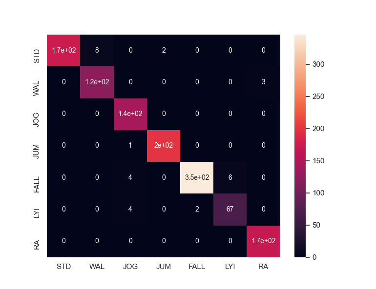

# Realtime-Fall-Dectection-and-Human-Activity-Recognition-Using-MLP

Realtime Fall Detection and Human Activity Recognition using Multilayer Perceptron Neural Network from gyroscope and accelerometer sensor sent from a ESP-32 Microcontroller

## Hardware Used

GY-521 MPU6050 IMU motion sensor

NodeMCU ESP32 Microcontroller

## Dataset Preview


## Visualization of How the Model Work


A list with a fixed size of 20 was used to hold 20 time steps worth of data in it. When the list is full, the data is then passed into the neural network for training or prediction. As soon as a new data packet is being sent, the new data packet is being appended to the list while the oldest data packet in the list is being removed. At any given time,the list only has a maximum size of 20 and the latest data is always present in the list. This allows the neural network to be trained to predict the movement of the subject as soon as the IMU sensor receives an update every 47.6 ms. Both the training data and the real time data are being fed into the neural network using this method.
One of the advantages of using this data structure is that it converts a time series problem to a simple classification problem by including past data in the input sequence to make a prediction. Using this method, the neural network is tasked to predict the movement of the wearer based on the latest data received with reference to the past 19 timesteps of data. This method makes the prediction fast and reliable as it “snapshots” the motion of the subject like an image frame in a video sequence.

## Usage 

Training is done using the Model_Training.py file. Please specify the dataset location in:

```python
df = pd.concat([pd.read_csv(f) for f in glob.glob('./[Dataset_Folder_Path]/*.csv')], ignore_index = True)
```

To test the model without using any hardware please use the Model_Testing.py file. Please specify the saved model path and the testing dataset path in :
```python
df = pd.concat([pd.read_csv(f) for f in glob.glob('./test/*.csv')], ignore_index = True)

model = tf.keras.models.load_model('./model/model_4')
```

## Results







## Confusion Matrix




## License
[MIT](https://choosealicense.com/licenses/mit/)
